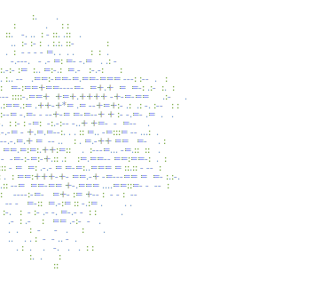

# Kayke — Engenheiro de Software · Desenvolvedor Mobile

```
Construindo experiências mobile rápidas, responsivas e bonitas.
Background em UI/UX guiando cada decisão de desenvolvimento.
```


---

## Sobre



Desenvolvedor front-end na **Apresenta.me**, atuando em plataformas web para o mercado imobiliário brasileiro.

Mais de 7 anos de experiência em **UI/UX e product design**, que hoje aplico na construção de interfaces — do protótipo no Figma ao código em produção.

<br clear="both" />

---

## Stack

**Front-end**
- React, React Native, TypeScript
- Design responsivo, arquitetura de componentes, gerenciamento de estado

**Back-end**
- Node.js, Python
- APIs REST, modelagem de banco de dados, migrations

**Ferramentas e fluxo de trabalho**
- Git, VS Code, Figma, Obsidian
- Testes: Vitest, React Testing Library, Playwright
- Banco de dados: PostgreSQL

---

## Projetos em destaque

### **UserRegistryProject**
Sistema em Java para registro de usuários e relatórios, aplicando os padrões **Singleton** e **Decorator**.  
*Tecnologias:* Java  
[→ Repositório](https://github.com/kxyke/UserRegistryProject)

### **conversor-de-moedas**
Conversor de moedas bidirecional, exercício de programação funcional (funções puras, imutabilidade, composição).  
*Tecnologias:* JavaScript  
[→ Repositório](https://github.com/kxyke/conversor-de-moedas)

### **agenda-contatos**
Agenda de contatos via terminal com CRUD completo e sistema de favoritos.  
*Tecnologias:* Python  
[→ Repositório](https://github.com/kxyke/agenda-contatos)

### **cambio-facil**
Conversor de moedas simples e responsivo (USD/EUR/GBP → BRL).  
*Tecnologias:* HTML, CSS, JavaScript  
[→ Repositório](https://github.com/kxyke/cambio-facil)

---

## Contato

Email: [devkayke@gmail.com](mailto:devkayke@gmail.com)  
LinkedIn: [in/kxyke](https://linkedin.com/in/kxyke)  
Portfólio: [kxyke.com](https://kxyke.com)
